# PCS Module Flowcharts

This document summarizes the control logic of each core function and advanced algorithm module.

Core functions and advanced algorithms are organized below with flowchart diagrams showing decision logic and signal flow.

---

## Core Functions

### 1. grid_connected_inverter

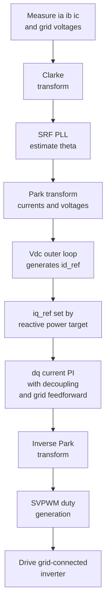

---

### 2. black_start_controller

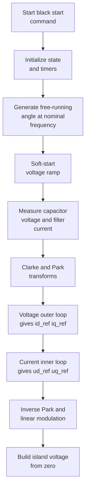

---

### 3. afe_rectifier

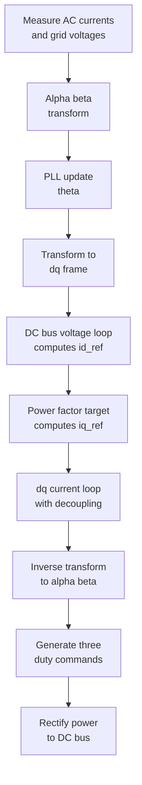

---

### 4. cccv_charger

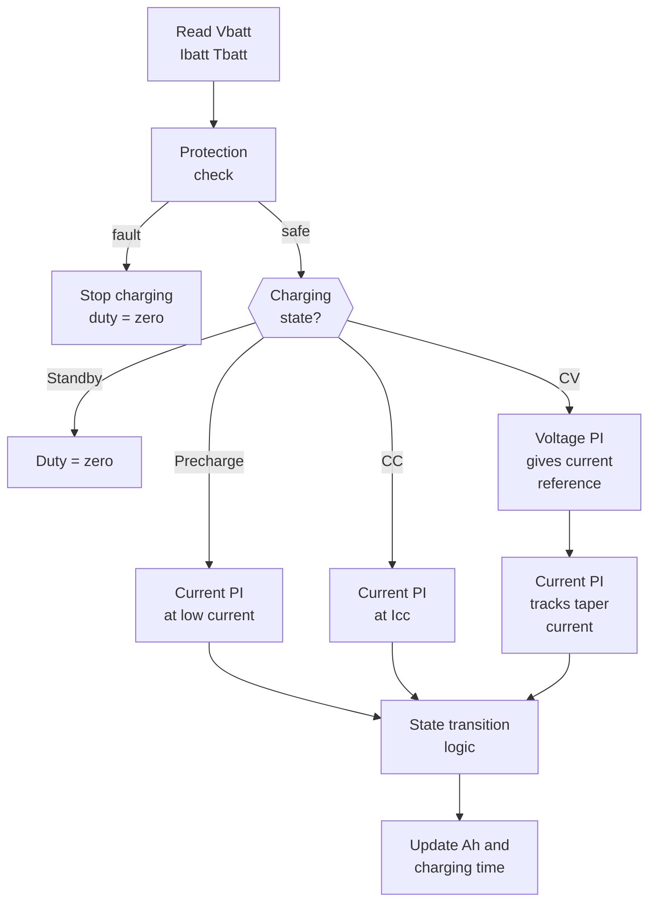

---

## Advanced Algorithms

### 5. npc_midpoint_balance

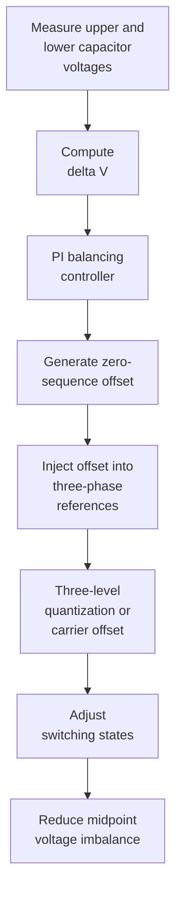

---

### 6. islanding_detection

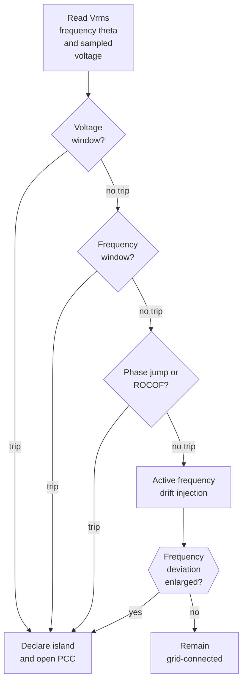

---

### 7. circulating_current_suppressor

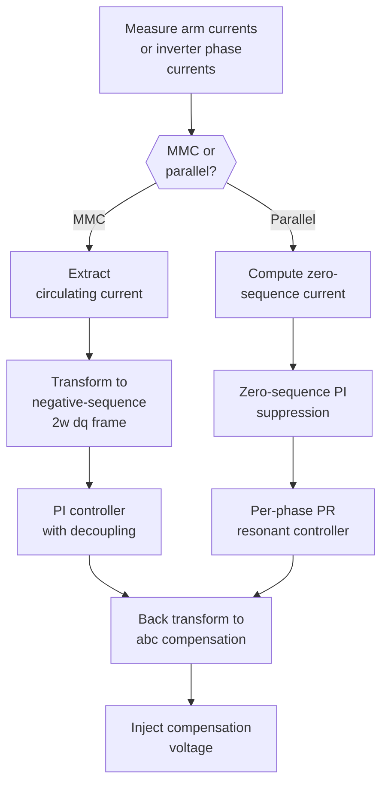

---

### 8. droop_control

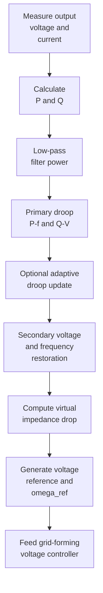

---

### 9. vsg_controller

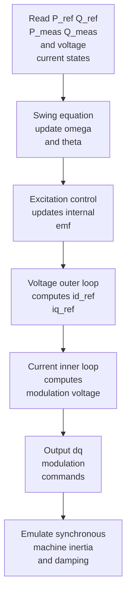

---

### 10. multi_inverter_parallel

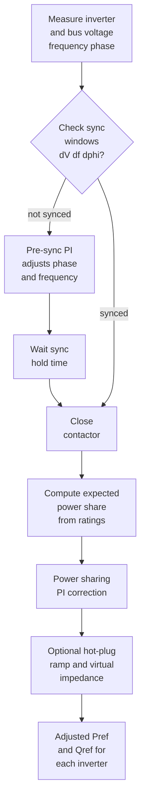

---

## Recommended Load Models for Islanded Operation

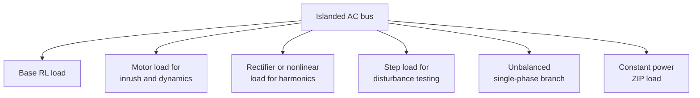

---

## Quick Reference: Module Purposes

| Module | Key Function | Domain |
|--------|--------------|--------|
| grid_connected_inverter | Grid-following PQ control via PLL + dq current loops | AC bus |
| black_start_controller | Island voltage buildup, V/f soft-start | AC bus |
| afe_rectifier | AC-to-DC power processing with unity PF | AC/DC |
| cccv_charger | Battery charging with 4-stage state machine | DC charging |
| npc_midpoint_balance | 3-level inverter neutral point stabilization | DC midpoint |
| islanding_detection | Grid disconnection detection (passive + active) | System protection |
| circulating_current_suppressor | MMC or parallel inverter circulating current reduction | AC/DC |
| droop_control | Primary frequency/voltage regulation | Microgrid |
| vsg_controller | Virtual synchronous machine emulation | Microgrid AC |
| multi_inverter_parallel | Synchronization and power sharing between units | Microgrid |

